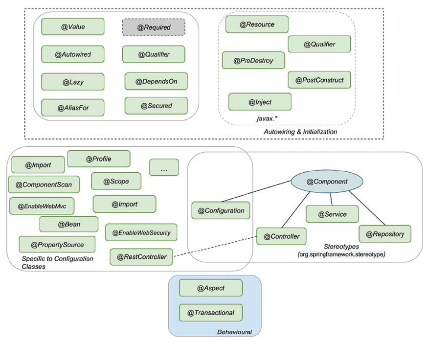
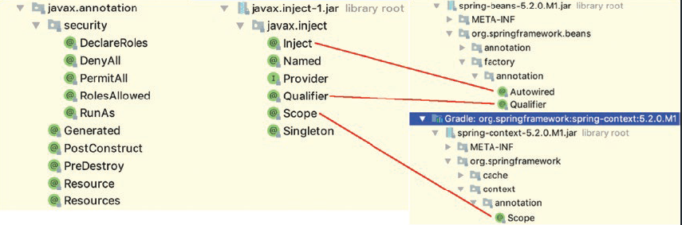
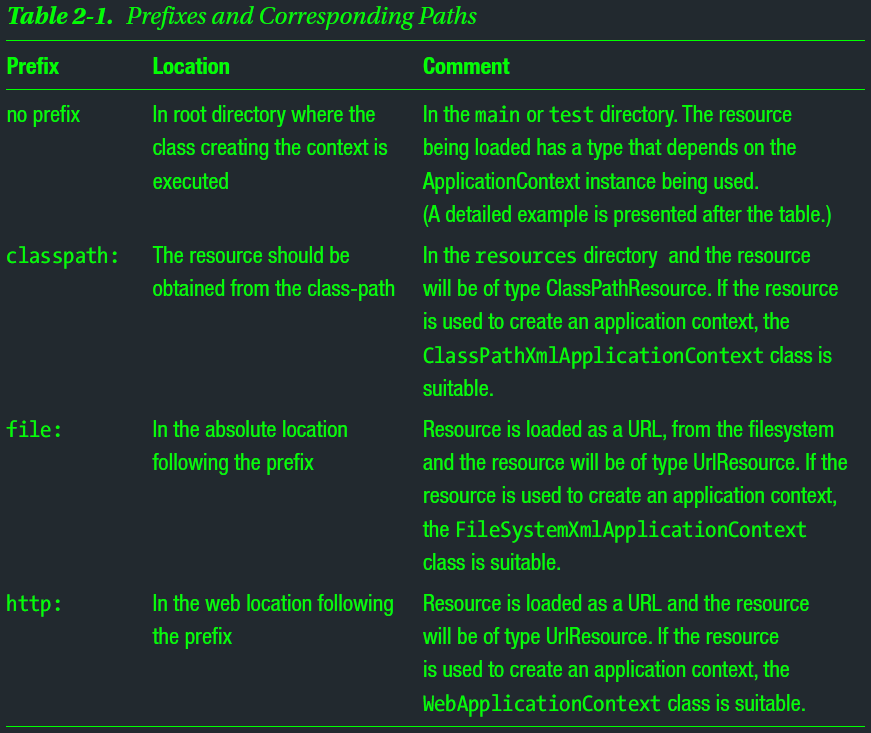
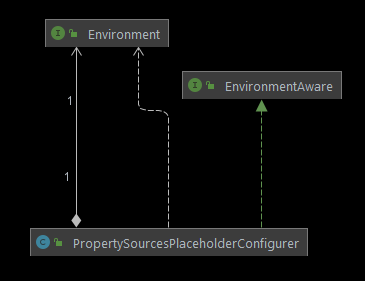
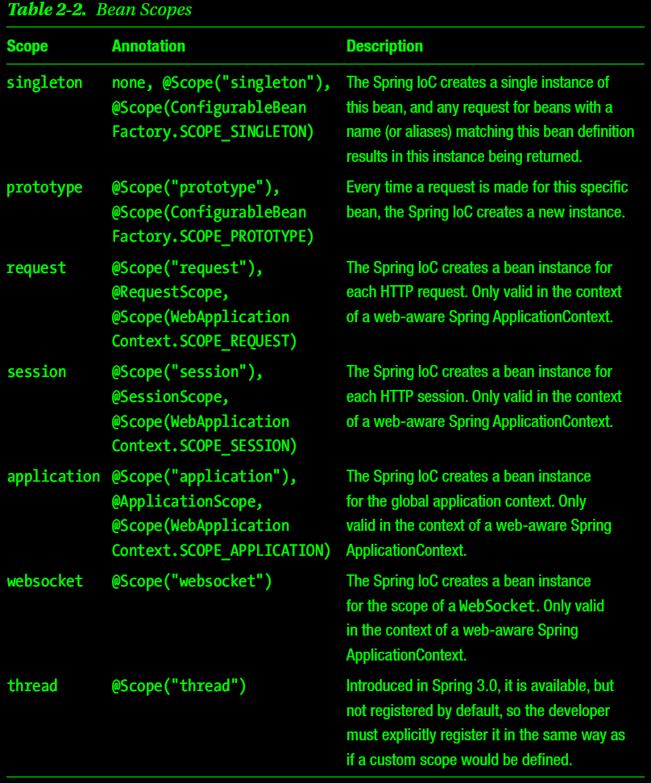
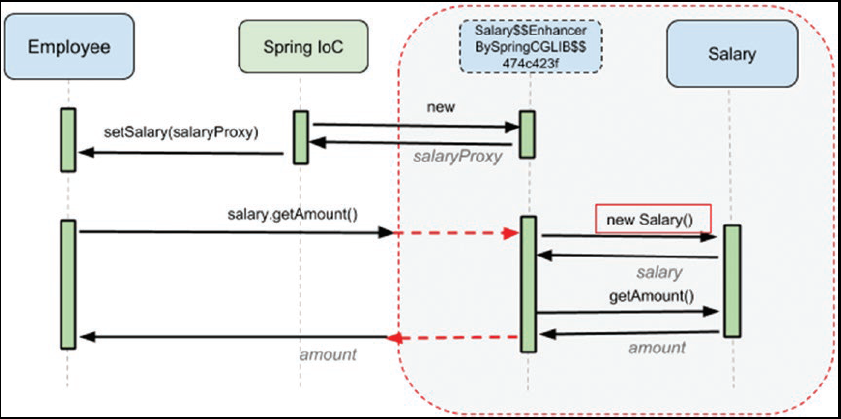
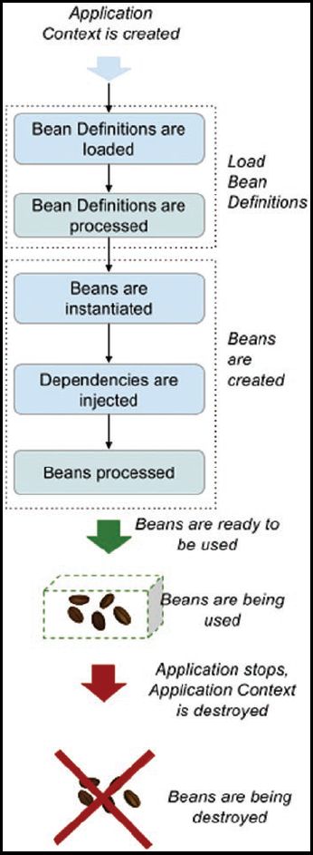
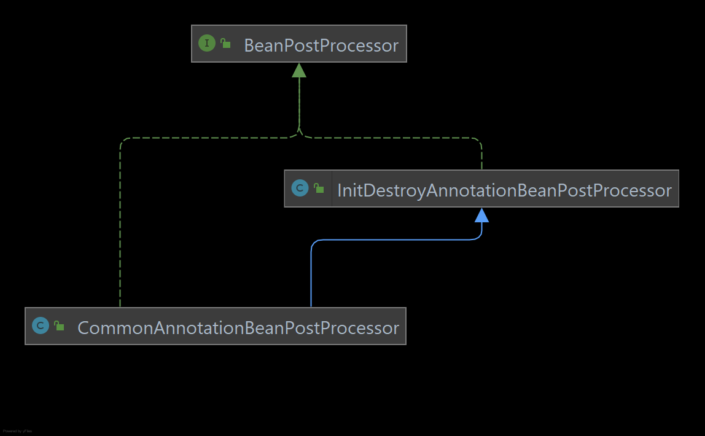
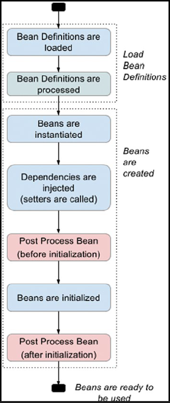

# Spring's IoC & DI

## Core Spring Modules for Spring IoC & DI
- ### spring-core
- ### spring-beans
- ### spring-context
- ### spring-context-support
- ### spring-expressions
- ### [spring-test](https://www.baeldung.com/integration-testing-in-spring) 


## The Annotations

|  |
| --- |

- ### Stereotype Annotations
    - #### Mark classes According to their Purpose

        > Annotations denoting the roles of types or methods in the overall 
        > architecture (at a conceptual, rather than implementation, level) 
        
        > Stereotype, is for suggesting a role of particular class that is being 
        > annotated
        
        > In addition to the obvious component-scanning functionality, 
        > Spring suggests that they make nice point-cut demarcations for your 
        > AOP needs
        
        > denote something | denote that: to be a sign of something
         
        > Stereotype: something conforming to a fixed or general pattern; 
        > especially: a standardized mental picture that is held in common by 
        > members of a group and that represents an oversimplified opinion, 
        > prejudiced attitude, or uncritical judgment

    - #### ``` @Component ``` 
        - template for any Spring-managed component(bean)
    - #### ``` @Repository ``` 
        - template for a component used to provide data access, specialization 
          of the @Component annotation for the DAO layer
    - #### ``` @Service ``` 
        - template for a component that provides service execution, 
          specialization of the @Component annotation for the Service layer
    - #### ``` @Controller ``` 
        - template for a web component, specialization of the @Component 
          annotation for the web layer 
    - #### ``` @Configuration ```
        - configuration class containing bean definitions (methods annotated 
          with @Bean) 

- ### Autowiring and Initialization Annotations
    - Defines which dependency should be injected and what the bean looks like
    - #### ``` @Autowired ```
        - Core annotation for this group
        - Used on dependencies to instruct the Spring IoC to take care of 
          injecting them
        - Can be used on fields, constructors, setters and even methods 
          mentioned in the Injection Types section
        - Use with ``` @Qualifier ``` from Spring to specify name of the bean 
          to inject
    - #### ``` @Inject ```
        - From ``` javax.inject ``` package , equivalent annotation to 
          ``` @Autowired ```
        - Use with ``` @Qualifier ``` from ``` javax.inject ``` to specify name 
          of the bean to inject
    - #### ``` @Resource ```
        - From ``` javax.annotation ``` package
        - Equivalent annotation to ``` @Autowired ``` 
        - Provides a name attribute to specify name of the bean to inject
    - #### ``` @Required ```
        - Spring annotation that marks a dependency as mandatory
        - Deprecated since Spring 5.1
    - #### ``` @Lazy ```
        - Dependency will be injected the first time it is used
        - Avoid using it if possible
            - When starting a Spring App, ``` ApplicationContext ``` 
              implementations eagerly create and configure all singleton beans 
              as part of the initialization process
            - Useful for spotting configuration errors fast

- ### Annotations appearing only in (and on) Configuration classes
    - They are infrastructure specific
    - They define the configuration resources, the components, and their scope
    - #### ``` @Bean ```
    - #### ``` @Profile ```
    - #### ``` @Import ```
    - #### ``` @Scope ```
    - #### ``` @ComponentScan ```
    - #### ``` @PropertySource ```
    - etc. 

- ### Behavioral Annotations
    - Annotations that define behavior of a bean
    - #### ``` @Aspect ```
    - #### ``` @Transactional ```

- ### DI Annotations from JDK
    |  |
    | --- |


## Spring Config Classes & App Context

> Application context should be closed after the app finished

> When create app context, use ``` ConfigurableApplicationContext ``` to 
> reference it because this interface extends ``` Closeable ```

### Classes annotated with ``` @Configuration ```
- #### Contains bean declarations(@Bean)
- #### Tell how the beans can be found 
    - Configured by adding extra annotations (e.g., @Profile, @Scope) 
- #### Any Spring App has at its core one or more Configuration Classes
    - Contain bean declarations
    - Configured to tell where to look for bean declarations

### Provides the Config for an App
- #### Implements ``` ApplicationContext ``` which extends ``` BeanFactory ```
    - ``` BeanFactory ``` is the root interface accessing the Bean Container
- #### Implementations of ``` ApplicationContext ``` manage bean definitions
    - uniquely identified by their name

### An ``` ApplicationContext ``` implementation is able to
- #### Access beans using ``` BeanFactory ``` methods
- #### Load file resources using relative or absolute paths or URLs
- #### Publish events to registered listeners
- #### Resolve messages and support internationalization

### Spring IoC Container Creates & Initializes An App Context 
- #### Needs a configuration provided by
    - One or more XML file
    - A configuration class or more
    - both of above

### Spring IoC Container creates an App Context

### Spring IoC Container initializes an App Context with a Configuration
  - provided by a resource
      - an XML file (or more)
      - or, a configuration class (or more)
      - or both of above

### Provides a Resource as a String value
  - #### Spring Container loads the resource based on the prefix of the String value
  - #### Spring Container uses different classes to instantiate an App Context
      - based on the prefix of the provided String value
         

### How to Load a Resource
  - The App Context must implement interface 
    ``` org.springframework.core.io.ResourceLoader ```
    ``` 
    // No prefix
    Resource template = ctx.getResource("application-config.xml");
    ```

### The Loaded Resource Type dependes on the App Context Type
| App Context Type | Resource Type |
| ---------------- | ------------- |
| ClassPathXmlApplicationContext | ClassPathResource |
| FileSystemXmlApplicationContext | FileSystemResource |
| WebApplicationContext | ServletContextResource |
  - #### To force the resource type, no matter what context type used
      - the resource must be specified using the desired prefix

### How Spring IoC Container creates an App Context
  - #### Using an instance implementing ``` ApplicationContext ``` 
      - ``` org.springframework.context.annotation.AnnotationConfigApplicationContext ```
    
    ``` 
    @Configuration
    public class WebConfig {
    
    }///:~
    ```
    
    ``` 
    ApplicationContext appContext = 
            new AnnotationConfigApplicationContext(WebConfig.class);
    ```
  - #### ``` @Configuration ``` is a @Component annotation
      - The core annotation for creating beans
      - Means that the configuration class itself is a declaration for a bean
        ``` 
        07:01:54.582 [main] INFO  b.a.adapter.in.web.WebConfigTest - >>>>>>> Bean webConfig
        ```

### Declare Beans in a Configuration Class
  - #### Using ``` @Bean ``` annotation with a method
  - #### The annotated method has a return type of the class of the Bean
  - #### The annotated method name is the bean id
  - #### Every bean declared in a Spring application is a singleton by default
  - #### Spring IoC Container calls Bean methods when the App Context is initially created
  - #### Beans with dependencies, have two ways to be decalred
      - Using ``` @Autowired ``` 
      - Using ``` @Bean ``` in a configuration class 
      
### Scan Beans being not part of Configuration classes
  - Enable configuration class with bean scanning: add ``` @ComponentScan ```
      - [Not Recommended] No attribute, scan annotated classes in the current package and all sub-packages
      - With a various list of attributes for filtering and reducing scope of scanning
      
### Load Property Source
  - #### ``` @PropertySource ```
      - Adds a bean of type ``` PropertySource ``` to Spring's ``` Environment ```
      - Used to read property values from a property file set as argument
      - #### Also require a bean of ``` PropertySourcesPlaceholderConfigurer ```
          - ``` 
            public class PropertySourcesPlaceholderConfigurer
                    extends PlaceholderConfigurerSupport
                    implements EnvironmentAware
            ```
          - To replace the placeholders set as arguments for the ``` @Value ``` 
            annotated properties
          - Resolves ${...} placeholders within bean definition property values and
            ``` @Value ``` annotations against the current Spring Environment and
            its set of ``` PropertySources ```
          - It's bean method should be static
          - It's bean should be picked up eariler than adding property values in 
            the config class
  - #### ``` org.springframework.core.env.Environmwnt ```
      - ``` public interface Environment extends PropertyResolver ```
      - Spring Apps use it to provide a way to access the environment where the  
        current app is running
      - This bean models two key aspects of an application environment:
          - properties 
          - profiles 
      - Methods related to property access are exposed via the 
        ``` PropertyResolver ``` super interface
      - The role of the ``` Environment ``` bean is to provide a convenient way 
        to declare property sources and inject property values from them where 
        required
      - In most cases, however, app-level beans should not need to interact with 
        the ``` Environment ``` directly 
        - but instead may have to have ``` ${...} ``` property values replaced 
          by a property placeholder configurer such as 
          ``` PropertySourcesPlaceholderConfigurer ```, which itself is 
          ``` EnvironmentAware ``` and as of Spring 3.1 is registered by default 
          when using <context:property-placeholder/>
      - ``` EnvironmentAware ``` is an interface to be implemented by any bean 
        that wishes to be notified of the Environment that it runs in
        ``` 
        void setEnvironment(Environment environment)
        ```
        |  |
        | --- |

  ``` 
    @Slf4j
    @Configuration
    @RequiredArgsConstructor
    @PropertySource("classpath:db/datasource.properties")
    public class DataSourceConfig {
    
        @Value("${spring.datasource.url}")
        private String url;
    
        @Value("${spring.datasource.driverClassName}")
        private String driverClassName;
    
        @Value("${spring.datasource.username}")
        private String username;
    
        @Value("${spring.datasource.password}")
        private String password;
    
        private final Environment environment;
    
        @Bean
        public static PropertySourcesPlaceholderConfigurer
        propertySourcesPlaceholderConfigurer() {
            return new PropertySourcesPlaceholderConfigurer();
        }
    
        @Bean
        DataSource dataSource() throws SQLException {
    
            DriverManagerDataSource driverManagerDataSource =
                    new DriverManagerDataSource();
    
            driverManagerDataSource.setDriverClassName(this.driverClassName);
            driverManagerDataSource.setUrl(this.url);
            driverManagerDataSource.setUsername(this.username);
            driverManagerDataSource.setPassword(this.password);
    
            log.info(">>>>>> Access pw with Environment: {}",
                    this.environment.getProperty("spring.datasource.password"));
    
            return driverManagerDataSource;
        }
    
    }///:~
   ```


### [``` @PropertySource ``` with ``` YAML ``` Files](https://www.baeldung.com/spring-yaml-propertysource)

``` 
@Slf4j
@Configuration
@PropertySource(
        value = "classpath:data/datasource.yml",
        factory = AppDataResourceCfg.YamlPropertySourceFactory.class)
public class AppDataResourceCfg {

    @Bean
    static PropertySourcesPlaceholderConfigurer
    propertySourcesPlaceholderConfigurer() {
        return new PropertySourcesPlaceholderConfigurer();
    }

    @Bean
    SimpleBean simpleBean(
            @Value("${spring.core.di.simpleBeanId}") String uuidStr,
            @Value("${spring.core.di.simpleBeanIsComplicated}") String isComplicatedStr) {

        return new DiSimpleBean(
                UUID.fromString(uuidStr),
                Boolean.getBoolean(isComplicatedStr));
    }

    static class YamlPropertySourceFactory implements PropertySourceFactory {

        @Override
        public org.springframework.core.env.PropertySource<?> createPropertySource(
                String name, EncodedResource encodedResource) throws IOException {

            YamlPropertiesFactoryBean yamlPropertiesFactory =
                    new YamlPropertiesFactoryBean();
            Resource resource = encodedResource.getResource();
            yamlPropertiesFactory.setResources(resource);

            Properties properties = yamlPropertiesFactory.getObject();

            return new PropertiesPropertySource(resource.getFilename(), properties);
        }
    }

}///:~
```


## Injection Types

### Overview 

#### Spring supports three types of Dependency Injection
  - Constructor Injection
  - Setter Injection
  - Field Injection

### ``` @Autowired ``` Annotation declares Dependencies in Spring
- Automatic Dependency Injection
- Used on fields, constructors, setters, and even methods
- Indicates that Spring should take care of injecting that dependency
- Enabled only in Spring App using component scanning and stereotype annotations 
  to create beans

### How does Spring Know What to Inject?
- Every bean in the application context has a Unique Identifier
- It is the developer’s responsibility to name beans accordingly if needed
- To declare beans when using Annotations, must annotate classes with 
  stereotype annotations: 
    - ``` @Componentand ``` 
    - ``` @Service ```
    - ``` @Repository ``` 
    - ``` @Controller ```
- Spring IoC container down-cases the first letter of the class names and sets 
  them as the bean names
- To rename the bean, give the name to the @Component annotation (or any of the 
  stereotype annotations) as argument
- Use ``` @Bean ``` to give bean more names (aliases), the method name won't be 
  used for Bean-Id anymore

### ``` @Description``` Adds a Description to a Bean 


## Constructor Injection

> Starting with Spring 4.3 using``` @Autowired ``` if the class has a single 
> constructor is no longer necessary
 
> ``` @Bean ``` methods are declared within ``` @Configuration ``` classes, 
> and they are detected by the Spring IoC container without the need for 
> classpath scanning 

### More than one bean with the same type
``` 
@Configuration
public class MultiBeanAppCfg {
    @Bean
    SimpleBean simpleBeanOne() {
        return new SimpleBeanImpl();
    }
    @Bean
    SimpleBean simpleBeanTwo() {
        return new SimpleBeanImpl();
    }
    @Bean
    ComposedBean composedBean(final SimpleBean simpleBean) {
        return new ComposedBeanImpl(simpleBean);
    }
}///:~
```

#### Throws Exceptions:
- ``` org.springframework.beans.factory.UnsatisfiedDependencyException ```
- ``` org.springframework.beans.factory.NoUniqueBeanDefinitionException ```

#### The Causes
- Have two beans with the same ``` SimpleBean ``` type
- Neither is annotated with ``` @Qualifier ``` 
- Neither of them is named ``` simpleBean ```

#### Solutions
1. Add ``` @Component("simpleBean") ```
2. Specify a name for the bean created in the configuration class
   annotate the method ``` simpleBeanOne() ``` as ``` @Bean("simpleBean") ```
3. Specify a name for the bean created in the configuration class by modifying 
   the method name from ``` simpleBeanOne() ``` to ``` simpleBean() ```
4. Use ``` @Qualifer ```
   ``` 
   @Configuration
    public class MultiBeanAppCfg {
        @Bean
        SimpleBean simpleBeanOne() {
            return new SimpleBeanImpl();
        }
        @Bean
        SimpleBean simpleBeanTwo() {
            return new SimpleBeanImpl();
        }
        @Bean
        ComposedBean composedBean(@Qualifier("simpleBeanOne") SimpleBean simpleBean) {
            return new ComposedBeanImpl(simpleBean);
        }
    }///:~
   ```

### ``` @Value ``` for Scalar Data
- The ``` @Value ``` annotation is used when the value to inject is a scalar
> The term "Scalar" comes from linear algebra, where it differentiates a number 
> from a vector or matrix 
> In computing, "Scalar" has a similar meaning
> It distinguishes a single value such as an integer or float from a data 
> structure like an array
> In Spring, "Scalar" refers to any value that is not a bean and cannot be 
> treated as such

In creating a bean, there are two steps that need to be executed one after the other

The bean first needs to be instantiated, and then the bean must be initialized

### The constructor injection combines two steps into one
- instantiating
- initializing 

### Assignment 
> Define two beans, one of type Person, one of type Book, make sure the book 
> bean is injected into the person bean


## Setter Injection

### Require Setter Method

### The Construction Sequence
- #### Instantiating: The bean is Instantiated with Constructors
    - If there are any dependencies declared as arguments for the constructor 
      these will be obviously initialized first 
- #### Initializing: Inject dependencies with using Setters
    - If the constructor does not require arguments, the bean is then initialized 
      by injecting the dependencies using setters

### Require adding ``` @Autowired ``` to Setters


## Field Injection

### The ``` @Autowired ``` Annotation is placed directly on a Class Field
- The Spring IoC Container injects a bean as value to the field when the 
  application is started


## Bean Scopes

> A Bean Scope is a term that describes how long a bean’s lifespan is

### Spring refers to the beans as Singletons

### Singleton is the default scope
  - A singleton bean is created when the application is bootstrapped
  - A singleton bean is managed by the Spring IoC container until the application 
    is shutdown or the context is closed

### The Spring IoC creates a Single Instance for each Bean
- which is destroyed when the application context is shut down

### Use ``` @Scope ``` to change the Scope of a Bean

|  |
| --- |

### Constants Matching the Scope Types

``` 
ConfigurableBeanFactory.SCOPE_PROTOTYPE
ConfigurableBeanFactory.SCOPE_SINGLETON
```

``` 
WebApplicationContext.SCOPE_REQUEST
WebApplicationContext.SCOPE_SESSION
WebApplicationContext.SCOPE_APPLICATION
```

### Solve Dependencies between Beans with Different Scopes

#### A Prototype Bean depends on a Singleton Bean
- Every time the prototype bean is requested from the context, a new instance 
  is created

#### A Singleton Bean Depends on a Prototype Bean

#### How Can Spring IoC Refresh the dependency on the Non_Singleton Bean
- The ``` ScopedProxyMode ``` enum is part spring-context module
- The ``` ScopedProxyMode ``` contains a list of values for scoped-proxy options
    - ``` DEFAULT ``` typically equals NO, unless a different default has been 
      configured at the component-scan instruction level 
    - ``` INTERFACES ``` Create a JDK Dynamic Proxy implementing all interfaces 
      exposed by the class of the target object 
    - ``` NO ``` Do not create a scoped proxy
    - ``` TARGET_CLASS ``` Create a class-based proxy (uses CGLIB)

#### ``` SCOPE_PROTOTYPE ``` should always work with a ScopedProxyMode
- ``` INTERFACE ``` or ``` TARGET_CLASS ```
- if this Prototype Bean will be used in any Singleton Bean

``` 
@Bean
@Scope(value = SCOPE_PROTOTYPE, proxyMode = INTERFACES)
UserSettings userSettings(@Value("${spring.core.di.scopes.defaultThemeName}")
                                  String themeName) {

    String sessionId = RandomStringUtils.randomAlphanumeric(7);
    return new WebUserSettings(sessionId, themeName);
}
```

|  |
| --- |


## ``` @AliasFor ```

### ``` @AliasFor ``` is to declare aliases for Annotation's Attributes

``` 
@Target({ElementType.TYPE, ElementType.METHOD})
@Retention(RetentionPolicy.RUNTIME)
@Documented
@Scope(ConfigurableBeanFactory.SCOPE_PROTOTYPE)
public @interface SalaryScope {

    // Equivalent to @AliasFor(annotation = Scope.class, attribute = "value")
    @AliasFor(annotation = Scope.class)
    String value() default "";

    // Equivalent to @AliasFor(annotation = Scope.class, attribute = "scopeName")
    @AliasFor(annotation = Scope.class)
    String scopeName() default "";

    // Equivalent to @AliasFor(annotation = Scope.class, attribute = "proxyMode")
    @AliasFor(annotation = Scope.class)
    ScopedProxyMode proxyMode() default ScopedProxyMode.INTERFACES;

}///:~
```

``` 
@Target({ElementType.TYPE, ElementType.METHOD})
@Retention(RetentionPolicy.RUNTIME)
@Documented
public @interface Scope {

	@AliasFor("scopeName")
	String value() default "";

	@AliasFor("value")
	String scopeName() default "";

	ScopedProxyMode proxyMode() default ScopedProxyMode.DEFAULT;

}
```


## Bean Lifecycle Under the Hood
- Covers the steps that are executed when a Spring Application is Run

### The Bean Starts Up as 
- a class that is annotated with a stereotype annotation
- a class is instantiated in a method annotated with @Bean 
  from a configuration class

### A Spring App has a Lifecycle of Three Phases
- #### Initialization / the Bootstrap Phase
    - Bean definitions are read 
    - Beans are created 
    - Dependencies are injected 
    - Resources are allocated
    - The App can be used
- #### Use
    - The App is up and running
    - It is used by clients 
    - Beans are retrieved and used to provide responses for their requests
- #### Destruction
    - The context is being shutdown
    - Resources are released
    - Beans are handed over to the Garbage Collector

### Detail Steps of an App Context Life
1. The application context is initialized
2. The bean definitions are loaded [from the configuration class]
3. The bean definitions are processed
4. Beans are instantiated
5. Dependencies are injected
6. Beans are processed
7. Beans are used
8. The context starts the destruction process
9. Beans are destroyed

|  |
| --- |

### The Bean Creation Process Stages
1. ___The beans are Instantiated___, the bean factory is calling the constructor of 
   each bean
     - If the bean is created using constructor dependency injection, the 
       dependency bean is created first and then injected where needed 
     - For beans that are defined in this way, the instantiation stage coincides 
       with the dependency injection stage
2. ___Dependencies are Injected___
     - For beans that are defined having dependencies injected via setter, this
       stage is separate from the instantiation stage 
     - The same goes for dependencies inject using field injection
3. ___Bean Post Process Beans are invoked BEFORE___ initialization
4. ___Beans are Initialized
5. ___Bean Post Process Beans are invoked AFTER___ initialization

### Bean Post Process Beans
- #### Splited by Initialization Stage into TWO parts
    - Invoked before the Initialization Stage
    - Invoked after the Initialization Stage
- #### A Bean can be a Bean Post Process Bean by having a @PostConstruct method 
    - This method must return void
    - Having no argument defined
    - Having any access identifier, better be ___private___
- #### The ``` @PostConstruct ``` Annotation 
    - is part of the JSR 25021
    - is used on a method that needs to be executed after dependency injection 
      is done to perform initialization
    - the annotated method must be invoked before the bean is used
    - may be called only once during a bean lifecycle 
    - if there are no dependencies to be injected, the annotated method will be 
      called after the bean is instantiated
    - only one method should be annotated with ``` @PostConstruct ```
    - To use this annotation, 
        - the ``` jsr250 ``` library must be in the classpath 
        - dependency of the jsr250.api module must be configured in the 
         module-info.java file
    - The method annotated with ``` @PostConstruct ``` 
        - is picked up by enabling component scanning (annotating configuration 
          classes with ``` @ComponentScanning ```)
        - called by a pre-init bean named
          ```org.springframework.context.annotation.internalCommonAnnotationProcessor ```
          of a type that implements the 
          ``` org.springframework.beans.factory.config.BeanPostProcessor ``` 
          interface named ``` org.springframework.beans.factory.config.BeanPostProcessor ```
        - ``` CommonAnnotationBeanPostProcessor ``` beans will be detected by 
          the application context, and instantiated before any other beans in 
          the container
    - Post Processors pick up methods that are annotated with ``` @PostConstruct ``` 
      and implement ``` postProcessBeforeInitialization ```
    - Post Processors that wrap beans with proxies will normally implement
      ``` postProcessAfterInitialization ```

|  |
| --- |

``` 
public interface BeanPostProcessor {
    @Nullable
	default Object postProcessBeforeInitialization(Object bean, String beanName) 
	        throws BeansException {
		return bean;
	}
	@Nullable
	default Object postProcessAfterInitialization(Object bean, String beanName) 
	        throws BeansException {
		return bean;
	}
}
```

|  |
| --- |

### Different Ways of Initializing a Bean Available in Spring
- Implementing the ``` org.springframework.beans.factory.InitializingBean ``` 
  interface and providing an implementation for the method ``` afterPropertiesSet ```
    - Not recommended since it couples the app code with Spring infrastructure
- Annotating with ``` @PostConstruct ``` the method that is called right after
  the bean is instantiated and dependencies injected
- Using Java configuration by annotating an initialization method with 
  ``` @Bean(initMethod="...") ``` , this method of initialization is very useful 
  when the code comes from a third-party library or a dependency and cannot be 
  edited 
    - ___the responsible for calling this annotated method___ is the same bean factory 
      which is responsible with the instantiation of the bean as well
      - DefaultListableBeanFactory
          - So the execution of this method matches the initialization stage of 
            a bean

``` 
class ComplicatedBean {

    private String id;

    ComplicatedBean() {
        log.info(">>>>>>> Constructing the ComplicatedBean ...");
    }

    @PostConstruct
    private void setBeanMonitor() {
        log.info(">>>>>>> Calling the @PostConstruct annotated method ...");
    }

    private void initializeId() {
        log.info(">>>>>>> Initializing the id of the ComplicatedBean ... ");
        this.id = RandomStringUtils.randomAlphanumeric(17);
    }

}///:~
```

``` 
13:38:17.901 [main] DEBUG o.s.b.f.s.DefaultListableBeanFactory -        Creating shared instance of singleton bean 'complicatedAppCfg'
13:38:17.901 [main] TRACE o.s.b.f.s.DefaultListableBeanFactory -        Creating instance of bean 'complicatedAppCfg'
13:38:17.903 [main] TRACE o.s.b.f.s.DefaultListableBeanFactory -        Eagerly caching bean 'complicatedAppCfg' to allow for resolving potential circular references
13:38:17.904 [main] TRACE o.s.b.f.s.DefaultListableBeanFactory -        Finished creating instance of bean 'complicatedAppCfg'
13:38:17.904 [main] DEBUG o.s.b.f.s.DefaultListableBeanFactory -        Creating shared instance of singleton bean 'complicatedBean'
13:38:17.904 [main] TRACE o.s.b.f.s.DefaultListableBeanFactory -        Creating instance of bean 'complicatedBean'
13:38:17.905 [main] TRACE o.s.b.f.s.DefaultListableBeanFactory -        Returning cached instance of singleton bean 'complicatedAppCfg'
13:38:17.911 [main] INFO  c.y.s.c.d.b.l.ComplicatedBean -               >>>>>>> Constructing the ComplicatedBean ...
13:38:17.912 [main] TRACE o.s.c.a.CommonAnnotationBeanPostProcessor -   Found init method on class [com.yulikexuan.spring.core.di.bean.lifecycle.ComplicatedBean]: private void com.yulikexuan.spring.core.di.bean.lifecycle.ComplicatedBean.setBeanMonitor()
13:38:17.913 [main] TRACE o.s.c.a.CommonAnnotationBeanPostProcessor -   Registered init method on class [com.yulikexuan.spring.core.di.bean.lifecycle.ComplicatedBean]: org.springframework.beans.factory.annotation.InitDestroyAnnotationBeanPostProcessor$LifecycleElement@6f0eec68
13:38:17.913 [main] TRACE o.s.b.f.s.DefaultListableBeanFactory -        Eagerly caching bean 'complicatedBean' to allow for resolving potential circular references
13:38:17.913 [main] TRACE o.s.c.a.CommonAnnotationBeanPostProcessor -   Invoking init method on bean 'complicatedBean': private void com.yulikexuan.spring.core.di.bean.lifecycle.ComplicatedBean.setBeanMonitor()
13:38:17.913 [main] INFO  c.y.s.c.d.b.l.ComplicatedBean -               >>>>>>> Calling the @PostConstruct annotated method ...
13:38:17.913 [main] TRACE o.s.b.f.s.DefaultListableBeanFactory -        Invoking init method  'initializeId' on bean with name 'complicatedBean'
13:38:17.913 [main] INFO  c.y.s.c.d.b.l.ComplicatedBean -               >>>>>>> Initializing the id of the ComplicatedBean ... 
13:38:17.914 [main] TRACE o.s.b.f.s.DefaultListableBeanFactory -        Finished creating instance of bean 'complicatedBean'
```

### The End Phase of Bean Lifecycle

> Complex Spring applications can have multiple application contexts, and they 
> can be closed independently

### Ways to Destroy Beans and Closing Resources (ONLY for Singleton Beans)

1. Implements ``` org.springframework.beans.factory.DisposableBean::destroy ``` method
     - NOT RECOMMENDED
     - Matching ``` org.springframework.beans.factory.InitializingBean ```
     - DisposableBean::destroys work will be delegated to 
       ``` DisposableBeanAdapter ```
2. Annotate a method with ``` @PreDestroy ```
3. In a ``` @Configuration ``` class, using ``` @Bean(destroyMethod="...") ```

``` 

```
class ComplexBean implements Bean, InitializingBean, DisposableBean {

    private final BeanElement beanElement;

    private BeanMonitor beanMonitor;

    @Override
    public BeanElement getBeanElement() {
        return this.beanElement;
    }

    @Override
    public boolean hasBeanMonitor() {
        return Objects.nonNull(this.beanMonitor);
    }

    @PostConstruct
    private void setBeanMonitor() {
        log.info(">>>>>>> Calling the @PostConstruct annotated method ...");
        this.beanMonitor = new BeanMonitor();
        this.beanMonitor.logBean(this);
    }

    @PreDestroy
    private void releaseResources() {
        log.info(">>>>>>> Destroy resource references ...");
        beanMonitor.close();
        beanMonitor = null;
    }

    @Override
    public void destroy() throws Exception {
        log.info(">>>>>>> Calling destroy method of DisposableBean ...");
    }

    @Override
    public void afterPropertiesSet() throws Exception {
        log.info(">>>>>>> Calling the afterPrpertiesSet method of InitializingBean ...");
    }

}///:~
``` 
16:47:26.064 [main] INFO  c.y.s.c.d.b.l.BeanLifecycleAppCfgTest - >>>>>>> App Context Initialized. Initialization done.
16:47:26.411 [main] DEBUG o.s.c.a.AnnotationConfigApplicationContext - Closing org.springframework.context.annotation.AnnotationConfigApplicationContext@616ac46a, started on Sun Aug 22 16:47:25 EDT 2021
16:47:26.412 [main] TRACE o.s.b.f.s.DefaultListableBeanFactory - Returning cached instance of singleton bean 'lifecycleProcessor'
16:47:26.412 [main] TRACE o.s.b.f.s.DefaultListableBeanFactory - Destroying singletons in org.springframework.beans.factory.support.DefaultListableBeanFactory@37efd131: defining beans [org.springframework.context.annotation.internalConfigurationAnnotationProcessor,org.springframework.context.annotation.internalAutowiredAnnotationProcessor,org.springframework.context.annotation.internalCommonAnnotationProcessor,org.springframework.context.event.internalEventListenerProcessor,org.springframework.context.event.internalEventListenerFactory,beanLifecycleAppCfg,complexBean,complicatedAppCfg,simpleBeanElement,complicatedBean]; root of factory hierarchy
16:47:26.412 [main] TRACE o.s.c.a.CommonAnnotationBeanPostProcessor - Invoking destroy method on bean 'complexBean': private void com.yulikexuan.spring.core.di.bean.lifecycle.ComplexBean.releaseResources()
16:47:26.412 [main] INFO  c.y.s.c.d.bean.lifecycle.ComplexBean - >>>>>>> Destroy resource references ...
16:47:26.412 [main] INFO  c.y.s.c.d.bean.lifecycle.BeanMonitor - >>>>>>> Release resources ... 
16:47:26.412 [main] TRACE o.s.b.f.s.DisposableBeanAdapter - Invoking destroy() on bean with name 'complexBean'
16:47:26.412 [main] INFO  c.y.s.c.d.bean.lifecycle.ComplexBean - >>>>>>> Calling destroy method of DisposableBean ...
16:47:26.413 [main] INFO  c.y.s.c.d.b.l.BeanLifecycleAppCfgTest - >>>>>>> App Context Closed. Usage done.
```

### The rules of the destroy method
- #### May be called only once during the bean lifecycle
- #### Can have any accessor but ``` private ``` is recommended
- #### Must not have any parameters
- #### Must return void

### Assignment

``` 
@Slf4j
@NoArgsConstructor
class DepBean implements IResource {

    @Override
    public void initialize() {
        log.info(">>>>>>> Initializing resource ...");
    }

    @Override
    public void close() {
        log.info(">>>>>>> Closing resource ... ");
    }

}///:~

@Slf4j
record FunBean(IResource depBean) implements InitializingBean, DisposableBean {

    FunBean {
        log.info(">>>>>>> Stage 1.: Calling constructor of the FunBean ... ");
        Objects.requireNonNull(depBean);
    }

    @PostConstruct
    private void initializeAfterConstructor() {
        log.info(">>>>>>> Stage 2.: Calling @PostConstruct method ... ");
    }

    @Override
    public void afterPropertiesSet() throws Exception {
        log.info(">>>>>>> Stage 3.: Calling " +
                "InitializingBean::afterPropertiesSet method ... ");
    }

    private void initializeResource() {
        log.info(">>>>>>> Stage 4.: Calling @Bean::initMethod");
        this.depBean.initialize();
    }

    @PreDestroy
    private void cleanUpBeforeDestroy() {
        log.info(">>>>>>> Stage 5.: Calling @PreDestroy method ... ");
    }

    @Override
    public void destroy() throws Exception {
        log.info(">>>>>>> Stage 6.: Calling DisposableBean::destroy method ... ");
    }

    private void closeResource() throws Exception {
        log.info(">>>>>>> Stage 7.: Calling @Bean::destroyMethod");
        this.depBean.close();
    }

}///:~

```

#### Output:
``` 
09:05:44.019 [main] DEBUG o.s.b.f.s.DefaultListableBeanFactory - Autowiring by type from bean name 'funBean' via factory method to bean named 'DepBean'

09:05:44.019 [main] INFO  c.y.s.c.d.b.l.assignment.FunBean - >>>>>>> Stage 1.: Calling constructor of the FunBean ... 

09:05:44.021 [main] TRACE o.s.c.a.CommonAnnotationBeanPostProcessor - Found destroy method on class [com.yulikexuan.spring.core.di.bean.lifecycle.assignment.FunBean]: private void com.yulikexuan.spring.core.di.bean.lifecycle.assignment.FunBean.cleanUpBeforeDestroy()
09:05:44.022 [main] TRACE o.s.c.a.CommonAnnotationBeanPostProcessor - Found init method on class [com.yulikexuan.spring.core.di.bean.lifecycle.assignment.FunBean]: private void com.yulikexuan.spring.core.di.bean.lifecycle.assignment.FunBean.initializeAfterConstructor()
09:05:44.022 [main] TRACE o.s.c.a.CommonAnnotationBeanPostProcessor - Registered init method on class [com.yulikexuan.spring.core.di.bean.lifecycle.assignment.FunBean]: org.springframework.beans.factory.annotation.InitDestroyAnnotationBeanPostProcessor$LifecycleElement@298b9643
09:05:44.022 [main] TRACE o.s.c.a.CommonAnnotationBeanPostProcessor - Registered destroy method on class [com.yulikexuan.spring.core.di.bean.lifecycle.assignment.FunBean]: org.springframework.beans.factory.annotation.InitDestroyAnnotationBeanPostProcessor$LifecycleElement@f91b78ec
09:05:44.022 [main] TRACE o.s.b.f.s.DefaultListableBeanFactory - Eagerly caching bean 'funBean' to allow for resolving potential circular references

09:05:44.022 [main] TRACE o.s.c.a.CommonAnnotationBeanPostProcessor - Invoking init method on bean 'funBean': private void com.yulikexuan.spring.core.di.bean.lifecycle.assignment.FunBean.initializeAfterConstructor()
09:05:44.022 [main] INFO  c.y.s.c.d.b.l.assignment.FunBean - >>>>>>> Stage 2.: Calling @PostConstruct method ... 

09:05:44.022 [main] TRACE o.s.b.f.s.DefaultListableBeanFactory - Invoking afterPropertiesSet() on bean with name 'funBean'
09:05:44.022 [main] INFO  c.y.s.c.d.b.l.assignment.FunBean - >>>>>>> Stage 3.: Calling InitializingBean::afterPropertiesSet method ... 

09:05:44.023 [main] TRACE o.s.b.f.s.DefaultListableBeanFactory - Invoking init method  'initializeResource' on bean with name 'funBean'
09:05:44.023 [main] INFO  c.y.s.c.d.b.l.assignment.FunBean - >>>>>>> Stage 4.: Calling @Bean::initMethod
09:05:44.023 [main] INFO  c.y.s.c.d.b.l.assignment.DepBean - >>>>>>> Initializing resource ...

09:05:44.023 [main] TRACE o.s.b.f.s.DefaultListableBeanFactory - Finished creating instance of bean 'funBean'

09:05:44.026 [main] TRACE o.s.b.f.s.DefaultListableBeanFactory - Returning cached instance of singleton bean 'lifecycleProcessor'
09:05:44.354 [main] TRACE o.s.b.f.s.DefaultListableBeanFactory - Returning cached instance of singleton bean 'funBean'
09:05:44.397 [main] DEBUG o.s.c.a.AnnotationConfigApplicationContext - Closing org.springframework.context.annotation.AnnotationConfigApplicationContext@57576994, started on Tue Aug 24 09:05:43 EDT 2021
09:05:44.398 [main] TRACE o.s.b.f.s.DefaultListableBeanFactory - Returning cached instance of singleton bean 'lifecycleProcessor'

09:05:44.398 [main] TRACE o.s.b.f.s.DefaultListableBeanFactory - Destroying singletons in org.springframework.beans.factory.support.DefaultListableBeanFactory@6f152006: defining beans [org.springframework.context.annotation.internalConfigurationAnnotationProcessor,org.springframework.context.annotation.internalAutowiredAnnotationProcessor,org.springframework.context.annotation.internalCommonAnnotationProcessor,org.springframework.context.event.internalEventListenerProcessor,org.springframework.context.event.internalEventListenerFactory,assignmentCfg,DepBean,funBean]; root of factory hierarchy
09:05:44.398 [main] TRACE o.s.c.a.CommonAnnotationBeanPostProcessor - Invoking destroy method on bean 'funBean': private void com.yulikexuan.spring.core.di.bean.lifecycle.assignment.FunBean.cleanUpBeforeDestroy()
09:05:44.398 [main] INFO  c.y.s.c.d.b.l.assignment.FunBean - >>>>>>> Stage 5.: Calling @PreDestroy method ... 

09:05:44.398 [main] TRACE o.s.b.f.s.DisposableBeanAdapter - Invoking destroy() on bean with name 'funBean'
09:05:44.398 [main] INFO  c.y.s.c.d.b.l.assignment.FunBean - >>>>>>> Stage 6.: Calling DisposableBean::destroy method ... 

09:05:44.398 [main] TRACE o.s.b.f.s.DisposableBeanAdapter - Invoking destroy method 'closeResource' on bean with name 'funBean'
09:05:44.398 [main] INFO  c.y.s.c.d.b.l.assignment.FunBean - >>>>>>> Stage 7.: Calling @Bean::destroyMethod
09:05:44.398 [main] INFO  c.y.s.c.d.b.l.assignment.DepBean - >>>>>>> Closing resource ... 

09:05:44.398 [main] TRACE o.s.b.f.s.DisposableBeanAdapter - Invoking destroy method 'close' on bean with name 'DepBean'
09:05:44.398 [main] INFO  c.y.s.c.d.b.l.assignment.DepBean - >>>>>>> Closing resource ... 
```


## Bean Declaration Inheritance

### Scenario I Both of Parent and Child are Concrete Classes

``` 
@Getter
@ToString
@Component
class ParentBean {

    @Value("Smith")
    String faimilyName;

    String surname;

    ParentBean(@Value("John") String surname) {
        this.surname = surname;
    }

}///:~
```

``` 
@Getter
@ToString(callSuper = true)
@Component
class ChildBean extends ParentBean {

    private Boolean adult;

    ChildBean(@Value("Lil' John") String surname, @Value("false") Boolean adult) {
        super(surname);
        this.adult = adult;
    }

}///:~
```

``` 
@Configuration
@ComponentScan(basePackages = "com.yulikexuan.spring.core.di.bean.inheritance")
class FamilyAppCfg {
}///:~
```

#### How to create Beans of Parent and Child?
- Must use bean name (the class name by default) as the parameter with bean 
  type parameter together
``` 
ConfigurableApplicationContext familyAppCtx = 
        new AnnotationConfigApplicationContext(FamilyAppCfg.class);
ParentBean parentBean = familyAppCtx.getBean("parentBean", ParentBean.class);
ChildBean childBean = familyAppCtx.getBean("childBean", ChildBean.class);
```


## Injecting Dependencies That Are Not Beans

### Create an Instance of ``` Converter ```

``` 
class StringToLocalDate implements Converter<String, LocalDate> {

    private DateTimeFormatter dateTimeFormatter;

    private StringToLocalDate(DateTimeFormatter dateTimeFormatter) {
        this.dateTimeFormatter = dateTimeFormatter;
    }

    static StringToLocalDate of(@NonNull DateTimeFormatter dateTimeFormatter) {
        return new StringToLocalDate(dateTimeFormatter);
    }

    @Override
    public LocalDate convert(String source) {
        return LocalDate.parse(source, dateTimeFormatter);
    }

}///:~
```

### Define the Converter Bean in the configuration class

``` 
@Bean
Converter<String, LocalDate> stringToLocalDateConverter(
        DateTimeFormatter dateTimeFormatter) {
    return StringToLocalDate.of(dateTimeFormatter);
}
```

### Add the Converter to ``` ConversionServiceFactoryBean ``` 
- in the configuration class
``` 
@Bean
ConversionServiceFactoryBean conversionServiceFactoryBean(
        Converter<String, LocalDate> stringToLocalDateConverter) {

    ConversionServiceFactoryBean factory = new ConversionServiceFactoryBean();
    factory.setConverters(Set.of(stringToLocalDateConverter));

    return factory;
} 
```

### Define the ``` ConversionService ``` Bean with the ``` ConversionServiceFactoryBean ```
``` 
@Bean
ConversionService conversionService(ConversionServiceFactoryBean factory) {
    return factory.getObject();
}
```

### The whole configuration class

``` 
package com.yulikexuan.spring.core.di.converter;

import org.springframework.beans.factory.annotation.Value;
import org.springframework.context.annotation.Bean;
import org.springframework.context.annotation.Configuration;
import org.springframework.context.support.ConversionServiceFactoryBean;
import org.springframework.core.convert.ConversionService;
import org.springframework.core.convert.converter.Converter;
import java.time.LocalDate;
import java.time.format.DateTimeFormatter;
import java.util.Set;

@Configuration
class ConversionAppCfg {

    static final String SIMPLE_DATE_FORMATTER_PATTERN = "yyyy-MM-dd";

    @Bean
    ConversionService conversionService(ConversionServiceFactoryBean factory) {

        return factory.getObject();
    }

    @Bean
    ConversionServiceFactoryBean conversionServiceFactoryBean(
            Converter<String, LocalDate> stringToLocalDateConverter) {

        ConversionServiceFactoryBean factory = new ConversionServiceFactoryBean();
        factory.setConverters(Set.of(stringToLocalDateConverter));

        return factory;
    }

    @Bean
    DateTimeFormatter dateTimeFormatter() {
        return DateTimeFormatter.ofPattern(SIMPLE_DATE_FORMATTER_PATTERN);
    }

    @Bean
    Converter<String, LocalDate> stringToLocalDateConverter(
            DateTimeFormatter dateTimeFormatter) {

        return StringToLocalDate.of(dateTimeFormatter);
    }

    @Bean
    Creature personBean(@Value("1977-10-17") LocalDate birthDate,
                        @Value("John Mayer") String name) {

        return PersonBean.of(birthDate, name);
    }

}///:~
```

### The ``` @Value ``` annotation for Inserting Scalar Values
``` 
@Autowired
void setNoOne(@Value("${spring.core.di.scalars.noOne}") int noOne) {
    this.noOne = noOne;
}
```

### Use Collections as Beans

``` 
class CollectionAppCfg {

    @Bean("element")
    Element element() {
        return SimpleElement.of(UUID.randomUUID());
    }

    @Bean("elementCopy")
    @Scope(SCOPE_PROTOTYPE)
    Element elementCopy() {
        return SimpleElement.of(UUID.randomUUID());
    }

    @Bean
    List<Element> simpleBeanList() {
        return List.of(element(), elementCopy());
    }

    @Bean
    Set<Element> simpleBeanSet() {
        return Set.of(element(), elementCopy());
    }

    @Bean
    Map<String, Element> simpleBeanMap() {
        return Map.of(
                "SimpleElement", element(),
                "elementCopy", elementCopy());
    }

    @Bean
    EmptyCollectionHolder collectionHolder() {
        return new EmptyCollectionHolder(simpleBeanList(), simpleBeanSet(),
                simpleBeanMap());
    }

}///:~
```

### Inject Values from Other Beans by Using SpEL

``` 
@Slf4j
@Configuration
class InjectFromBeanPropertiesCfg {

    @Bean
    public Properties dbProps() {

        Properties p = new Properties();

        p.setProperty("driverClassName", "org.h2.Driver");
        p.setProperty("url", "jdbc:h2:~/sample");
        p.setProperty("username", "sample");
        p.setProperty("password", "sample");

        return p;
    }

    @Bean
    public DataSource dataSource(
            @Value("#{dbProps.driverClassName}") String driverClassName,
            @Value("#{dbProps.url}") String url,
            @Value("#{dbProps.username}") String username,
            @Value("#{dbProps.password}") String password) throws
            SQLException {

        DriverManagerDataSource ds = new DriverManagerDataSource();

        ds.setDriverClassName(driverClassName);
        ds.setUrl(url);
        ds.setUsername(username);
        ds.setPassword(password);

        return ds;
    }

}///:~
```


## Bean Factories

### Implements the ``` BeanFactory ``` interface

``` 
class TaxFormulaFactoryBean implements FactoryBean<TaxFormula> {

    private TaxFormula taxFormula = new ScotlandRateFormula();

    TaxFormulaFactoryBean() {
        log.info(">>>>>>> Look ma, no definition!");
    }

    @Override
    public TaxFormula getObject() throws Exception {
        return this.taxFormula;
    }

    @Override
    public Class<?> getObjectType() {
        return ScotlandRateFormula.class;
    }

    @Override
    public boolean isSingleton() {
        return true;
    }

}///:~
```

### Extends the abstract class ``` AbstractBeanFactory ```

``` 
class FlexTaxFormularFactoryBean extends AbstractFactoryBean<TaxFormula> {

    public FlexTaxFormularFactoryBean() {
        this.setSingleton(false);
    }

    @Override
    public Class<?> getObjectType() {
        return ScotlandRateFormula.class;
    }

    @Override
    protected TaxFormula createInstance() throws Exception {
        return new ScotlandRateFormula();
    }
    
}///:~
```


## Autowiring

### This annotation declares the dependencies to be injected

### The bean to process this annotation is
- ``` internalAutowiredAnnotationProcessor ``` which implementing 
  ``` AutowiredAnnotationBeanPostProcessor ``` --> ``` BeanPostProcessor ``` 

### The ``` @Autowired ``` requires the dependency to be mandatory
- Can be changed by setting the required attribute to false
    ``` 
    @Autowired(required=false)
    public void setDataSource(DataSource dataSource) {
    this.dataSource = dataSource;
    } 
    ```
    - If a bean of type ``` DataSource ``` is not found within the context the
      value that is injected is ``` null ```

### Use generic types as qualifiers
- The ``` @Qualifier ``` annotation is no longer needed to name different beans here

``` 
@Component
class JdbcDetectiveRepo
        extends JdbcAbstractRepo<Detective>
        implements DetectiveRepo {

}///:~

@Component
class JdbcCriminalCaseRepo
        extends JdbcAbstractRepo<CriminalCase>
        implements CriminalCaseRepo {

}///:~

@ContextConfiguration(classes = {AutowiredAppCfg.class})
@ExtendWith(SpringExtension.class)
@DisplayName("Test Autowired Annotation - ")
@ExtendWith(MockitoExtension.class)
@DisplayNameGeneration(DisplayNameGenerator.ReplaceUnderscores.class)
class AutowiredAppCfgTest {

    @Autowired
    private JdbcAbstractRepo<Detective> detectiveRepo;

    @Autowired
    private JdbcAbstractRepo<CriminalCase> criminalCaseRepo;

    @Test
    void autowired_Annotation_Can_Inject_Generic_Type_Instances() {

        assertThat(this.detectiveRepo).isNotNull();
        assertThat(this.criminalCaseRepo).isNotNull();
    }

}///:~
```


## ``` @Lazy ```

### This annotation postpones the creation of a bean until it is first accessed 

### ``` @Lazy ``` can be used with a ``` @Component ``` or ``` @Bean ``` annotation
- This is useful when the dependency is a huge object, and you do not want to 
  keep the memory occupied with this object until it is really needed 

``` 
@Component
@Lazy
public class SimpleBean { ... }

// or on a @Bean
@Configuration
public class RequestRepoConfig {
    @Lazy
    @Bean
    public RequestRepo anotherRepo(){
        return new JdbcRequestRepo();
    }
}
```

### The only correct usage that allows the dependency to be lazily initialized 

``` 
// on injection point
@Repository
public class JdbcPetRepo extends JdbcAbstractRepo<Pet>
        implements PetRepo {
    ...
    @Lazy
    @Autowired(required=false)
    public void setDataSource(DataSource dataSource) {
        this.dataSource = dataSource;
    }
}
```
- Without ``` @Autowired(required = false) ```, the Spring IoC container will 
  do its normal job and inject dependencies when the bean is created and 
  ignoring the presence of @Lazy


## Meta Annotations

### Many of the annotations provided by Spring can be Meta-Annotations

### A Meta-Annotation can annotate another annotations

### All stereotype specializations are annotated with ``` @Component ```

### Meta-Annotations can be composed to obtain other annotations

``` 
@Target({ElementType.METHOD, ElementType.TYPE})
@Retention(RetentionPolicy.RUNTIME)
@Transactional("customTransactionManager", timeout="90")
public @interface CustomTx {
    boolean readOnly() default false;
}
```


## Using Multiple Configuration Classes

### Using Spring Test Module

- In a Spring test environment, the spring-test module provides the 
``` @ContextConfiguration ``` to bootstrap a test environment using one or 
multiple configuration resources

#### Maven Dependency

``` 
    <dependency>
        <groupId>org.springframework</groupId>
        <artifactId>spring-test</artifactId>
        <scope>test</scope>
    </dependency>
```

#### Annotations for Unit Test

``` 
@ExtendWith(SpringExtension.class)
@ContextConfiguration(classes = {AutowiredAppCfg.class})
```

### The spring-test module provides the ``` @ContextConfiguration ```
- to bootstrap a test environment using one or multiple configuration resources
- provides a different way to test spring apps by delegating the responsibility 
  of creating the application context to the ___Spring Test Framework___


### The ``` @Import ``` annotation imports the configuration from another class 
- into the class annotated with it

### Having multiple config classes is useful to separate beans based on their purpose

### Separate infrastructure beans from application beans 
- Because infrastructure change between environments 
``` 
ConfigurableApplicationContext ctx = new AnnotationConfigApplicationContext(
        TestDataSourceConfig.class, RepositoryConfig.class);
```

## End at Page 168